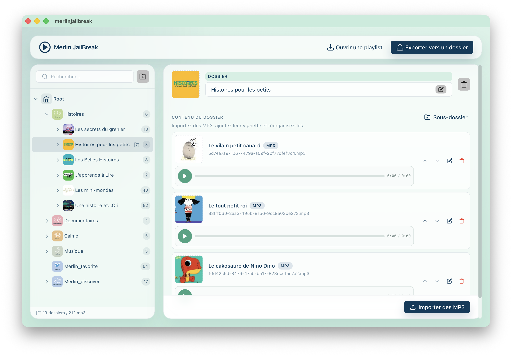

# Merlin-jailbreak
Un éditeur pour la fabrique à histoires Merlin (Bayard / Radio France) qui permet d'ajouter et de supprimer ses propres histoires, musiques ou sons.

## Pré-requis
Ouvrir la Merlin en dévissant les 4 vis dans le dos de l'enceinte, l'emplacement pour carte micro-SD est alors accessible.

## Utilisation
Les histoires sont toutes composées à la fois d'une image et d'un son.
Les fichiers images sont au format jpeg avec une résolution de 128x128, et les sons sont au format mp3 en stéréo à 128ko/s.

Vous pouvez télécharger les réleases depuis https://github.com/IArchi/Merlin-jailbreak/releases/

 - Ouvrez l'application.
 - Cliquez sur "Ouvrir une playlist".
 - Vous pouvez ajoutez/modifiez/supprimez des histoires ou des musiques.
 - Vous pouvez également créer des sous-dossiers pour les ranger.
 - Cliquez sur "Sauvegarder la playlist dans un dossier ou la carte SD" pour sauvegarder tous vos changements.
 - Vous pouvez ensuite copier le contenu du dossier dans la carte SD de la fabrique à histoires Merlin.
 - N'oubliez pas de l'éjecter proprement de votre ordinateur une fois terminé.

### MacOS

En cas de problème de droits à l'ouverture:
- Ouvrez le terminal
- Tapez `sudo xattr -rd com.apple.quarantine `
- Faites glisser et déposez l'application dans le terminal, elle devrait ressembler à ceci `sudo xattr -rd com.apple.quarantine /Applications/[LockedApp].app`
- Appuyez sur Entrée et entrez votre mot de passe
- Ouvrez l'application

### Windows

### Linux

### Développement

Lancer la commande:
`npm run tauri dev`

## Remerciements
Merci à [Djokeur](https://github.com/djokeur/) pour l'algorithme de lecture/écriture du fichier `playlist.bin`

